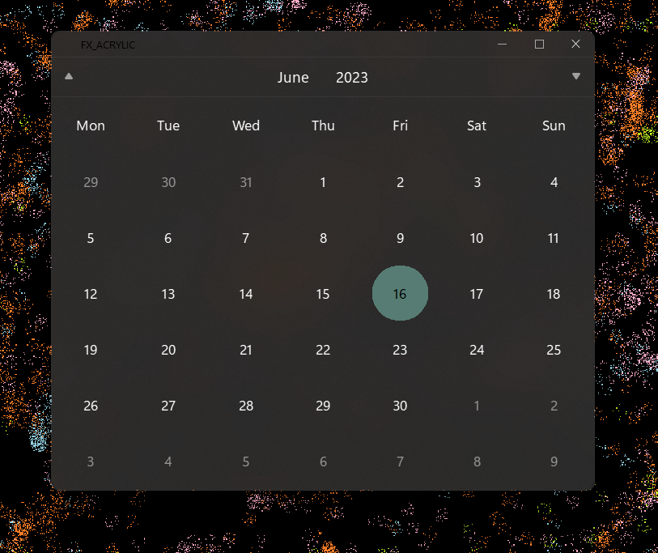
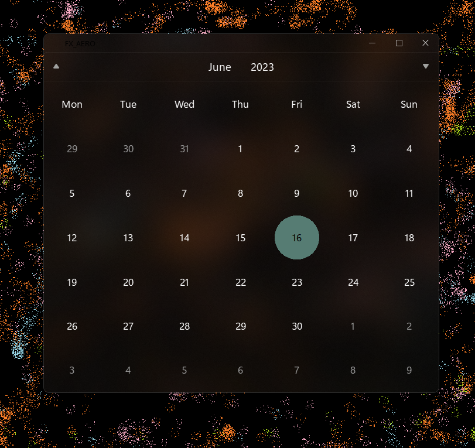
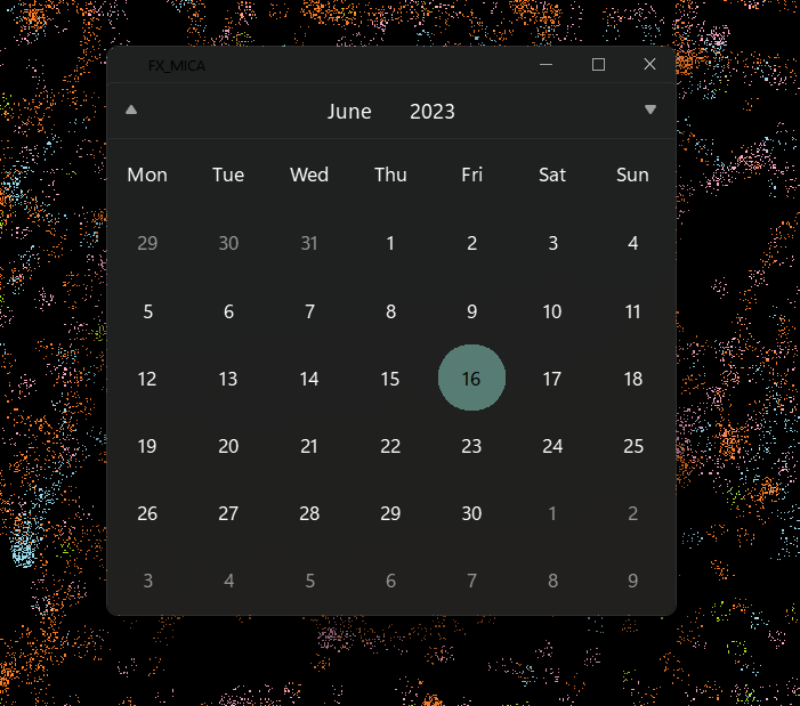

<p align="center">
  
</p>


# PySide2-Win11Theme

PySide2-Win11Theme is a coasy theme that offers a widget window class to inherit to all widgets the windows 11 theme.

## Features
- This thjeme uses the system accent color
- System dark and light mode
- Used Mica, Aero, Acrylic material on win32 apps


## Installing
```pwsh
pip install PySide2
```
```pwsh
pip install darkdetect
```
```pwsh
pip install pywin32
```

## Requirements
- Windows 11

## Usage
To create a window responding to the Windows 11 layout, we need to create a `Win11FXWindow`.
Here's an example with an `FX_MICA` layout:
```python

from PySide2 import QApplication

from PySide2 import QApplication, QVBoxLayout
>>>>>>> 901849c152ca26d7b2d7dc8c3202c7405f7ebfe1
from win11theme import *
import sys

app = QApplication(sys.argv)


window = Win11FXWindow() # Creates a window

window['fx'] = FX_MICA   # Adds the mica effect

window.raise_()          # Raises the titleBar


layout = QVBoxLayout()

window = Win11FXWindow() # Creates a window
window['fx'] = FX_MICA   # Adds the mica effect
window.raise_()          # Raises the titleBar

calendar = Calendar(window) #Included calendar
layout.addWiget(calendar)

layout1.setContentsMargins(0, 32, 0, 0) # Sets the margins to allow the titleBar to be not overrided (32px)

window.setLayout(layout)

window.show()

sys.exit(app.exec_())

```

- Use the `FX_AERO` layout for a transluent window.
- Use the `FX_ACRYLIC` for a real windows 11 like transluent window.
- Use the `FX_NONE` to clear all layout.

All commands are called with keywords.
For more info about the package used for the windowing system, please see [this help document](https://pyqt-frameless-window.readthedocs.io/).

## Screenshots
<p align="center">
  <b>
Acrylic FX
</b>
</p>




<p align="center">
  <b>
Aero FX
</b>
</p>



<p align="center">
  <b>
Mica FX
</b>
</p>




